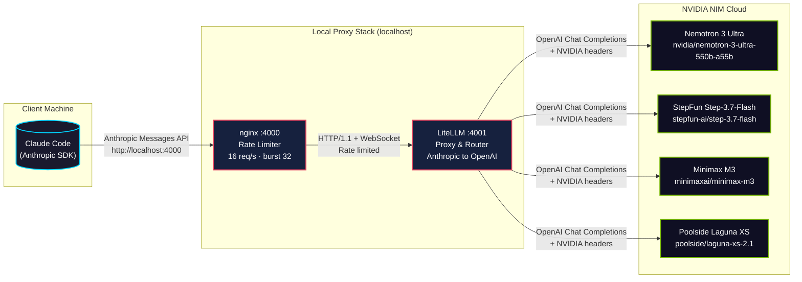
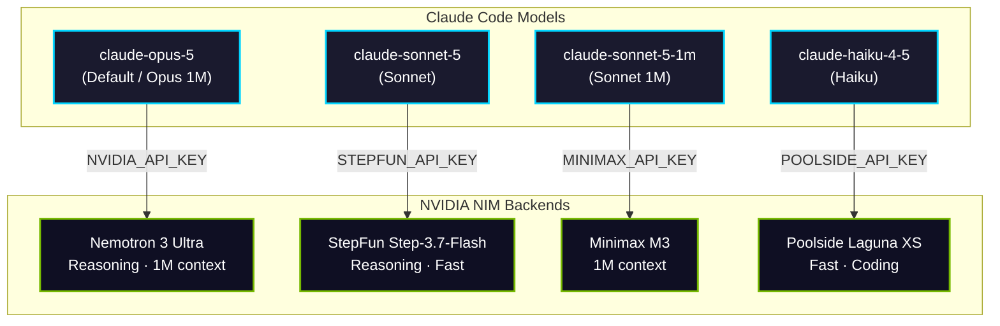
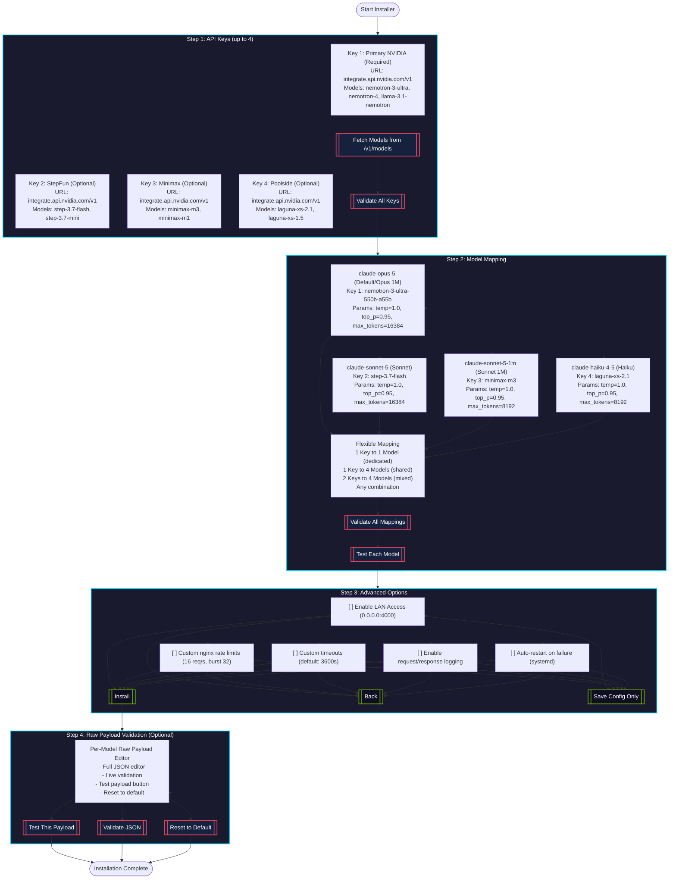

# 🤖 MyClaude — Claude Code via NVIDIA NIM Proxy

[](https://github.com/sponsors/S-V-J)
[](https://github.com/S-V-J/myclaude/stargazers)
[](LICENSE)

MyClaude lets you run [Claude Code](https://docs.anthropic.com/en/docs/claude-code) using NVIDIA NIM models instead of Anthropic's API. It sets up a local LiteLLM proxy that translates Anthropic-format requests into OpenAI-compatible calls to NVIDIA's infrastructure — no code changes to Claude Code needed.

## (Required) Current Status: 100% Functional

All 4 models tested and working:

| Menu Option | Model Name | NVIDIA NIM Backend | Status |
|-------------|------------|-------------------|--------|
| 1. Default (recommended) | `claude-opus-5` | nvidia/nemotron-3-ultra-550b-a55b | (Required) Works |
| 2. Opus (1M context) | `claude-opus-5` | nvidia/nemotron-3-ultra-550b-a55b | (Required) Works |
| 3. Sonnet | `claude-sonnet-5` | stepfun-ai/step-3.7-flash | (Required) Works |
| 4. Sonnet 5 (1M context) | `claude-sonnet-5-1m` | minimaxai/minimax-m3 | (Required) Works |
| 5. Haiku | `claude-haiku-4-5` | poolside/laguna-xs-2.1 | (Required) Works |

## ⚠️ Important: Bring Your Own NVIDIA API Keys

**You must have your own NVIDIA NIM API keys to use this system.** The installer does not provide keys.

Get free API keys at: https://build.nvidia.com

Each model backend may require a different API key:
- **Nemotron 3 Ultra** (Opus) → NVIDIA_API_KEY
- **StepFun Step-3.7-Flash** (Sonnet) → STEPFUN_API_KEY (optional, falls back to NVIDIA key)
- **Minimax M3** (Sonnet 1M) → MINIMAX_API_KEY (optional, falls back to NVIDIA key)
- **Poolside Laguna XS** (Haiku) → POOLSIDE_API_KEY (optional, falls back to NVIDIA key)

## How It Works



<!-- -->

### Request Flow

| Step | Component | Protocol | Details |
|------|-----------|----------|---------|
| 1 | **Claude Code** → nginx | HTTP/1.1 + SSE | Anthropic Messages format, `http://localhost:4000` |
| 2 | **nginx** → LiteLLM | HTTP/1.1 + WebSocket | Rate limited (16 req/s, burst 32), queues overflow |
| 3 | **LiteLLM** → NVIDIA NIM | OpenAI Chat Completions | Translates format, selects model via router, adds auth |
| 4 | **NVIDIA NIM** → Client | SSE Streaming | Model inference, streams tokens back through chain |

<!-- -->

### Model Routing Map



<!-- -->

## Why This Approach

- **No Anthropic API subscription needed** — uses NVIDIA NIM credits
- **Drop-in replacement** — Claude Code works unmodified, just pointed at a different URL
- **Rate limit protection** — nginx queues burst traffic; LiteLLM retries with backoff
- **Model routing** — different Claude models map to different NVIDIA backends automatically
- **Local-first** — everything runs on your machine, keys never leave your control

## Prerequisites

- **NVIDIA NIM API key(s)** — free tier available at [build.nvidia.com](https://build.nvidia.com)
- **Linux** with systemd (Ubuntu, Debian, WSL2, etc.)
- **Python 3.10+**
- **Claude Code CLI** — `npm install -g @anthropic-ai/claude-code`
- **nginx** — `sudo apt install nginx`
- **sudo access** — for system user creation and service setup

## Installation

### Option 1: Interactive TUI Installer (Recommended)

```bash
git clone https://github.com/S-V-J/myclaude.git && cd myclaude && bash install.sh
```

The installer launches a **Terminal User Interface (TUI)** that guides you through complete configuration:

#### TUI Configuration Flow



#### Raw Payload Example (Step 4)

```json
{
  "model": "nvidia/nemotron-3-ultra-550b-a55b",
  "messages": [{"role": "user", "content": "{{PROMPT}}"}],
  "temperature": 1.0,
  "top_p": 0.95,
  "max_tokens": 16384,
  "seed": 42,
  "stream": false,
  "extra_body": {
    "chat_template_kwargs": {"enable_thinking": true},
    "reasoning_budget": 16384
  }
}
```

#### TUI Features

| Feature | Description |
|---------|-------------|
| **Up to 4 API Keys** | Configure multiple NVIDIA keys for different model providers |
| **Service Provider URL** | Select or enter custom base URLs (default: NVIDIA integrate API) |
| **Model Discovery** | Click "Fetch Models" to auto-populate available models per key |
| **Flexible Mapping** | Map any key→model combination (1:1, 1:many, many:1) |
| **Raw Payload Editor** | Full JSON editor per model with live validation |
| **Live Testing** | Test each model mapping before installation |
| **Config Persistence** | Saves to `.env` and `config.yaml` automatically |

### Option 2: Automated Install (Makefile)

```bash
git clone https://github.com/S-V-J/myclaude.git && cd myclaude && make install
```

This runs everything non-interactively (requires `NVIDIA_API_KEY` env var).

### Option 3: Windows + WSL

Follow the WSL guide below, then run Option 1 or 2 inside WSL.

### WSL — Step-by-Step Setup

**1. Open PowerShell as Administrator**
Press `Win + X` → Select "Windows Terminal (Admin)" or "PowerShell (Admin)"

**2. Install Ubuntu 26.04 via WSL2**
```bash
wsl --install -d Ubuntu-26.04 --name myclaude --web-download
```

**3. Create Your Linux User**
```
Enter new UNIX username: myclaude
New password: ********
Retype new password: ********
```

**4. Run the installer**
```bash
git clone https://github.com/S-V-J/myclaude.git && cd myclaude && bash install.sh
```

## Usage

```bash
myclaude              # launch Claude Code with NVIDIA models
myclaude --help       # pass arguments through to Claude Code
myclaude "prompt"     # one-shot prompt
```

### Model Selection in Claude Code

When you run `myclaude`, Claude Code will show the model selector:

```
Select model
Switch between Claude models. Your pick becomes the default for new sessions.

  1. Default (recommended)  : proxy ai model nvidia/nemotron-3-ultra-550b-a55b
❯ 2. Opus (1M context) ✔    : proxy ai model nvidia/nemotron-3-ultra-550b-a55b
  3. Sonnet                 : proxy ai model stepfun-ai/step-3.7-flash
  4. Sonnet 5 (1M context)  : proxy ai model minimaxai/minimax-m3
  5. Haiku                  : proxy ai model poolside/laguna-xs-2.1
```

Your selection persists across sessions via Claude Code's config.

### Service Management

```bash
sudo systemctl status myclaude   # check if proxy is running
sudo systemctl restart myclaude  # restart after config changes
sudo systemctl stop myclaude     # stop the proxy
journalctl -u myclaude -f        # live log tail
```

### Convenience Aliases

After `source ~/.bashrc` or opening a new terminal:

```bash
myclaude-status  # sudo systemctl status myclaude
myclaude-logs    # journalctl -u myclaude -f
myclaude-start   # sudo systemctl start myclaude
myclaude-stop    # sudo systemctl stop myclaude
```

## Configuration Reference

| File | Purpose |
|------|---------|
| `.env` | Your API keys (gitignored, created by installer) |
| `.env.example` | Template showing required variables |
| `config.yaml` | LiteLLM model routing, retry settings, rate limits |
| `nginx-myclaude.conf` | nginx reverse proxy, rate limiting, timeouts |
| `litellm.service.template` | systemd unit template (paths filled at install) |
| `myclaude.sh` | `/usr/local/bin/myclaude` wrapper script |
| `install.sh` | TUI installer |

### .env Variables

```env
# Required — Primary NVIDIA NIM key (get at build.nvidia.com)
NVIDIA_API_KEY="nvapi-..."

# Optional — Separate keys for specific model providers (fallback to NVIDIA_API_KEY)
STEPFUN_API_KEY="nvapi-..."
MINIMAX_API_KEY="nvapi-..."
POOLSIDE_API_KEY="nvapi-..."

# Auto-generated — local proxy auth key (used by Claude Code)
LITELLM_MASTER_KEY="sk-local-..."

# Required — forces Anthropic message format compatibility
LITELLM_USE_CHAT_COMPLETIONS_URL_FOR_ANTHROPIC_MESSAGES="true"
```

### LiteLLM Config (`config.yaml`)

Key settings (managed by TUI installer):
- **Routing strategy**: `least-busy` — picks the model with fewest active requests
- **Fallbacks**: `claude-opus-5` → `claude-sonnet-5` on failure
- **Retries**: 5 attempts, 5s cooldown between retries
- **Parallel limits**: 15 max concurrent (stays safely under NVIDIA's 20 RPM tier)
- **Timeouts**: 3600s request timeout for long-running tasks

## Local Network Access

Other devices on your LAN (phones, tablets, other PCs) can also use MyClaude. The TUI installer offers this option and handles nginx binding + firewall rules.

Full guide: [LAN-ACCESS.md](LAN-ACCESS.md)

## Architecture Deep-Dive

### Request Flow

1. **Claude Code** formats a request as an Anthropic Messages API call
2. **nginx** receives it on `:4000`, applies rate limiting (16 req/s sustained, 32 burst), and forwards to LiteLLM
3. **LiteLLM** receives the Anthropic-format request, translates headers and body to OpenAI format, selects the target model via the complexity router, and forwards to NVIDIA NIM
4. **NVIDIA NIM** runs inference and streams SSE chunks back through the chain to Claude Code

### Why nginx in front of LiteLLM?

- **Burst absorption**: Claude Code can fire rapid parallel tool calls; nginx queues them smoothly
- **503 on overload**: Returns clean errors instead of crashing LiteLLM under load
- **WebSocket upgrade**: Proper streaming support for long completions
- **Future-proof**: Easy to add TLS, auth, or multi-tenant routing at the nginx layer

### Why a dedicated system user?

- Security isolation — the proxy runs with minimal privileges
- Clean ownership — venv, logs, and config all owned by one user
- No shell access — `nologin` shell prevents interactive logins

## Troubleshooting

| Issue | Fix |
|-------|-----|
| `myclaude: command not found` | Re-login or run `source ~/.bashrc` |
| `Failed to start LiteLLM` | Check `journalctl -u myclaude -n 20` for errors |
| `API key rejected` | Re-run installer, or edit `.env` and `sudo systemctl restart myclaude` |
| `Connection refused` | `sudo systemctl status myclaude` — service may have failed |
| `Port 4000 already in use` | Another service is using the port — check `sudo ss -tlnp \| grep 4000` |
| Slow responses | Check NVIDIA NIM status; try reducing `max_tokens` in config.yaml |
| Model returns 429 | API key rate limited — wait or use different key |
| TUI not displaying | Ensure terminal supports ANSI colors (most do) |

## Development / Contributing

```bash
# Run tests
make test

# Lint shell scripts
shellcheck install.sh myclaude.sh

# Validate config.yaml
yamllint config.yaml
```

## Sponsor

If this project saves you API costs or makes your workflow better, consider sponsoring:

[](https://github.com/sponsors/S-V-J)

Your support helps keep the project maintained and adds new model integrations.

## License

MIT — see [LICENSE](LICENSE) for details.