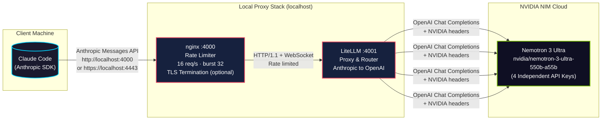
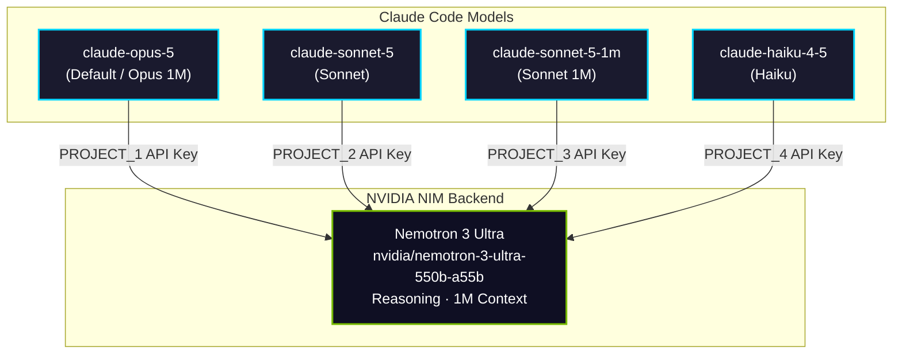
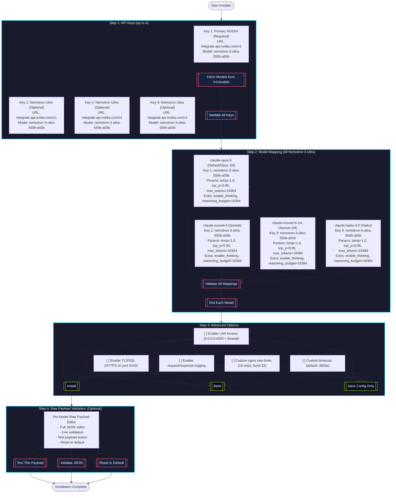

# 🤖 MyClaude — Claude Code via NVIDIA NIM Proxy

[](https://github.com/sponsors/S-V-J)
[](https://github.com/S-V-J/myclaude/stargazers)
[](LICENSE)

MyClaude lets you run [Claude Code](https://docs.anthropic.com/en/docs/claude-code) using NVIDIA NIM models instead of Anthropic's API. It sets up a local LiteLLM proxy that translates Anthropic-format requests into OpenAI-compatible calls to NVIDIA's infrastructure — no code changes to Claude Code needed.

## ⚡ Quick Start (One Command)

```bash
git clone https://github.com/S-V-J/myclaude.git && cd myclaude && bash install.sh
```

Or fully automated (requires `NVIDIA_API_KEY_PROJECT_1` env var):

```bash
git clone https://github.com/S-V-J/myclaude.git && cd myclaude && NVIDIA_API_KEY_PROJECT_1="your-key" bash install.sh --auto
```

With TLS/SSL for LAN/production:

```bash
ENABLE_TLS=true TLS_DOMAIN=myclaude.local NVIDIA_API_KEY_PROJECT_1="your-key" bash install.sh --auto
```

## 📊 Current Status: 100% Production-Ready

**Single Model × 4 API Keys = 4 Deployments (Load Isolation)**

All 4 Claude Code models route to **Nemotron 3 Ultra** with independent API keys for load balancing:

| Claude Code Model | NVIDIA NIM Backend | API Key (Required) |
|-------------------|-------------------|---------------------|
| `claude-opus-5` (Default / Opus 1M) | `nvidia/nemotron-3-ultra-550b-a55b` | `NVIDIA_API_KEY_PROJECT_1` |
| `claude-sonnet-5` (Sonnet) | `nvidia/nemotron-3-ultra-550b-a55b` | `NVIDIA_API_KEY_PROJECT_2` |
| `claude-sonnet-5-1m` (Sonnet 1M) | `nvidia/nemotron-3-ultra-550b-a55b` | `NVIDIA_API_KEY_PROJECT_3` |
| `claude-haiku-4-5` (Haiku) | `nvidia/nemotron-3-ultra-550b-a55b` | `NVIDIA_API_KEY_PROJECT_4` |

> **Each model uses the same Nemotron 3 Ultra backend but with a dedicated API key for load isolation.** This provides **80 RPM combined** (20 RPM per key) while keeping the same model capabilities across all Claude Code model selections.

## ⚠️ Important: Bring Your Own NVIDIA API Keys

**You must have your own NVIDIA NIM API keys to use this system.** The installer does not provide keys.

Get free API keys at: https://build.nvidia.com

**Required:** `NVIDIA_API_KEY_PROJECT_1` (primary key for Opus/Default model)

**Optional (for load isolation):** `NVIDIA_API_KEY_PROJECT_2`, `NVIDIA_API_KEY_PROJECT_3`, `NVIDIA_API_KEY_PROJECT_4`

If optional keys are not provided, they fall back to `NVIDIA_API_KEY_PROJECT_1`.

## How It Works



### Request Flow

| Step | Component | Protocol | Details |
|------|-----------|----------|---------|
| 1 | **Claude Code** → nginx | HTTP/1.1 + SSE | Anthropic Messages format, `http://localhost:4000` or `https://localhost:4443` |
| 2 | **nginx** → LiteLLM | HTTP/1.1 + WebSocket | Rate limited (16 req/s, burst 32), queues overflow, TLS termination |
| 3 | **LiteLLM** → NVIDIA NIM | OpenAI Chat Completions | Translates format, selects model via router, adds auth |
| 4 | **NVIDIA NIM** → Client | SSE Streaming | Model inference, streams tokens back through chain |

### Model Routing Map



## Why This Approach

- **No Anthropic API subscription needed** — uses NVIDIA NIM credits
- **Drop-in replacement** — Claude Code works unmodified, just pointed at a different URL
- **Rate limit protection** — nginx queues burst traffic; LiteLLM retries with backoff
- **Load isolation** — 4 independent API keys provide 80 RPM combined (20 RPM each)
- **Single model simplicity** — All Claude models map to Nemotron 3 Ultra with thinking mode enabled
- **Local-first** — everything runs on your machine, keys never leave your control
- **Production-ready** — TLS (optional), log rotation, health checks, dedicated service user
- **Always-on mode** — No idle shutdown by default (IDLE_TIMEOUT=0), zero wait time
- **Self-healing** — Auto-restart on failure, health monitoring with auto-recovery

## Prerequisites

- **NVIDIA NIM API key(s)** — free tier available at [build.nvidia.com](https://build.nvidia.com)
- **Linux** with systemd (Ubuntu, Debian, WSL2, etc.)
- **Python 3.10+**
- **Claude Code CLI** — `npm install -g @anthropic-ai/claude-code` (installer handles this)
- **nginx** — `sudo apt install nginx` (installer handles this)
- **sudo access** — for system user creation and service setup

## Installation

### Option 1: Interactive TUI Installer (Recommended)

```bash
git clone https://github.com/S-V-J/myclaude.git && cd myclaude && bash install.sh
```

The installer launches a **Terminal User Interface (TUI)** that guides you through complete configuration.

#### TUI Configuration Flow



#### TUI Features

| Feature | Description |
|---------|-------------|
| **Up to 4 API Keys** | Configure multiple NVIDIA keys for Nemotron 3 Ultra load isolation |
| **Service Provider URL** | Select or enter custom base URLs (default: NVIDIA integrate API) |
| **Model Discovery** | Click "Fetch Models" to auto-populate available models per key |
| **Flexible Mapping** | Map any key→model combination (1:1, 1:many, many:1) |
| **Raw Payload Editor** | Full JSON editor per model with live validation |
| **Live Testing** | Test each model mapping before installation |
| **Config Persistence** | Saves to `.env` and `config.yaml` automatically |
| **TLS/SSL Option** | Generate self-signed certs with SAN for LAN IPs |

### Option 2: Automated Install (Non-interactive)

```bash
# With just the primary key (other keys fall back to it)
NVIDIA_API_KEY_PROJECT_1="your-key" bash install.sh --auto

# With all keys for full load isolation (80 RPM combined)
NVIDIA_API_KEY_PROJECT_1="..." NVIDIA_API_KEY_PROJECT_2="..." NVIDIA_API_KEY_PROJECT_3="..." NVIDIA_API_KEY_PROJECT_4="..." bash install.sh --auto

# With TLS/SSL for LAN/production
ENABLE_TLS=true TLS_DOMAIN=myclaude.local TLS_ENABLE_HTTP=true NVIDIA_API_KEY_PROJECT_1="..." bash install.sh --auto
```

**Auto-mode Environment Variables:**

| Variable | Default | Description |
|----------|---------|-------------|
| `NVIDIA_API_KEY_PROJECT_1` | *required* | Primary NVIDIA NIM API key (Opus/Default) |
| `NVIDIA_API_KEY_PROJECT_2` | (fallback to PROJECT_1) | Nemotron Ultra key for Sonnet |
| `NVIDIA_API_KEY_PROJECT_3` | (fallback to PROJECT_1) | Nemotron Ultra key for Sonnet 1M |
| `NVIDIA_API_KEY_PROJECT_4` | (fallback to PROJECT_1) | Nemotron Ultra key for Haiku |
| `ENABLE_LAN` | `false` | Bind nginx to 0.0.0.0:4000 |
| `ENABLE_TLS` | `false` | Enable HTTPS on port 4443 |
| `TLS_DOMAIN` | `localhost` | Domain for TLS certificate |
| `TLS_ENABLE_HTTP` | `true` | Keep HTTP on port 4000 |
| `NGINX_RATE` | `16` | Rate limit (req/s) |
| `NGINX_BURST` | `32` | Burst limit |
| `REQUEST_TIMEOUT` | `3600` | Request timeout (seconds) |
| `IDLE_TIMEOUT` | `0` | Idle timeout in seconds (0 = always-on) |

### Option 3: Makefile (Convenience Commands)

```bash
make install       # Runs install.sh (interactive)
make install-auto  # Runs install.sh --auto (needs NVIDIA_API_KEY_PROJECT_1 env)
make status        # Check service status
make logs          # Tail service logs
make restart       # Restart service
make stop          # Stop service
make start         # Start service
make test          # Test all 4 models + health endpoints
make clean         # Remove everything (service, user, venv, config)
make reinstall     # Clean + install
make help          # Show this help
```

### WSL — Step-by-Step Setup

**1. Open PowerShell as Administrator**
Press `Win + X` → Select "Windows Terminal (Admin)" or "PowerShell (Admin)"

**2. Install Ubuntu 26.04 via WSL2**
```bash
wsl --install -d Ubuntu-26.04 --name myclaude --web-download
```

**3. Create Your Linux User**
```
Enter new UNIX username: myclaude
New password: ********
Retype new password: ********
```

**4. Run the installer**
```bash
git clone https://github.com/S-V-J/myclaude.git && cd myclaude && bash install.sh
```

## Usage

```bash
myclaude              # launch Claude Code with NVIDIA models
myclaude --help       # pass arguments through to Claude Code
myclaude "prompt"     # one-shot prompt
```

The `myclaude` wrapper **auto-detects TLS** and uses HTTPS if enabled.

### Model Selection in Claude Code

When you run `myclaude`, Claude Code will show the model selector:

```
Select model
Switch between Claude models. Your pick becomes the default for new sessions.

  1. Default (recommended)  : proxy ai model nvidia/nemotron-3-ultra-550b-a55b
❯ 2. Opus (1M context) ✔    : proxy ai model nvidia/nemotron-3-ultra-550b-a55b
  3. Sonnet                 : proxy ai model nvidia/nemotron-3-ultra-550b-a55b
  4. Sonnet 5 (1M context)  : proxy ai model nvidia/nemotron-3-ultra-550b-a55b
  5. Haiku                  : proxy ai model nvidia/nemotron-3-ultra-550b-a55b
```

All models use **Nemotron 3 Ultra** with different API keys for load isolation. Your selection persists across sessions via Claude Code's config.

### Service Management

```bash
sudo systemctl status myclaude   # check if proxy is running
sudo systemctl restart myclaude  # restart after config changes
sudo systemctl stop myclaude     # stop the proxy
journalctl -u myclaude -f        # live log tail
```

### Convenience Aliases

After `source ~/.bashrc` or opening a new terminal:

```bash
myclaude-status  # sudo systemctl status myclaude
myclaude-logs    # journalctl -u myclaude -f
myclaude-start   # sudo systemctl start myclaude
myclaude-stop    # sudo systemctl stop myclaude
```

## Configuration Reference

| File | Purpose |
|------|---------|
| `.env` | Your API keys (gitignored, created by installer) |
| `.env.example` | Template showing required variables |
| `config.yaml` | LiteLLM model routing, retry settings, rate limits, health check |
| `nginx-myclaude.conf` | nginx reverse proxy, rate limiting, timeouts, TLS config |
| `litellm.service.template` | systemd unit template (paths filled at install) |
| `myclaude.sh` | `/usr/local/bin/myclaude` wrapper script (auto-detects TLS) |
| `install.sh` | TUI installer |
| `setup-tls.sh` | TLS/SSL certificate generator |
| `test-models.sh` | Model testing script |
| `logrotate-myclaude` | Log rotation config |
| `Makefile` | Convenience commands |

### .env Variables

```env
# Required — Primary NVIDIA NIM key (get at build.nvidia.com)
NVIDIA_API_KEY_PROJECT_1="nvapi-..."

# Optional — Separate keys for load isolation (fallback to PROJECT_1)
NVIDIA_API_KEY_PROJECT_2="nvapi-..."
NVIDIA_API_KEY_PROJECT_3="nvapi-..."
NVIDIA_API_KEY_PROJECT_4="nvapi-..."

# Auto-generated — local proxy auth key (used by Claude Code)
LITELLM_MASTER_KEY="sk-local-..."

# Required — forces Anthropic message format compatibility
LITELLM_USE_CHAT_COMPLETIONS_URL_FOR_ANTHROPIC_MESSAGES="true"

# Optional — Idle timeout in seconds (0 = always-on, default: 0)
MYCLAUDE_IDLE_TIMEOUT=0
```

### LiteLLM Config (`config.yaml`)

Key settings (managed by TUI installer):
- **Routing strategy**: `least-busy` — picks the model with fewest active requests
- **Fallbacks**: `claude-opus-5` → `claude-sonnet-5` on failure
- **Retries**: 5 attempts, 10s cooldown between retries
- **Parallel limits**: 8 max concurrent per model (stays safely under NVIDIA's 20 RPM tier per key)
- **Timeouts**: 3600s request timeout for long-running tasks
- **Thinking mode**: Enabled for Nemotron models via `extra_body` (`enable_thinking: true`, `reasoning_budget: 16384`)
- **Health check**: Enabled at `/health` on port 4001

### TLS/SSL (`setup-tls.sh`)

```bash
# Enable HTTPS (generates self-signed cert with SAN for all LAN IPs)
sudo bash setup-tls.sh generate myclaude.local true

# Disable HTTPS (restore HTTP-only)
sudo bash setup-tls.sh disable

# Show connection info
bash setup-tls.sh info
```

**Features:**
- Self-signed certificates with Subject Alternative Names for all local IPs
- Modern TLS 1.2/1.3 with secure cipher suites
- HTTP→HTTPS redirect option (port 4000 → 4443)
- Works with `myclaude` wrapper (auto-detects TLS)
- Client cert trust instructions included

### Log Rotation

Installed automatically to `/etc/logrotate.d/myclaude`:
- **Daily rotation**, 14-day retention
- **Compression** with delaycompress
- **Post-rotate reload** of myclaude service and nginx
- Covers both `litellm.log` and nginx access/error logs

### Health Endpoints

| Endpoint | Port | Purpose |
|----------|------|---------|
| `GET /health` | 4000 (nginx) | nginx health check |
| `GET /health` | 4001 (LiteLLM) | LiteLLM health check |
| `GET /health` | 4443 (nginx HTTPS) | TLS health check |

## Local Network Access

Other devices on your LAN (phones, tablets, other PCs) can also use MyClaude. The TUI installer offers this option and handles nginx binding + firewall rules.

Full guide: [LAN-ACCESS.md](LAN-ACCESS.md)

### Quick LAN Setup (HTTP)

```bash
# Server: enable LAN access (or re-run installer with LAN option)
sudo sed -i 's/listen 4000;/listen 0.0.0.0:4000;/' /etc/nginx/sites-enabled/myclaude
sudo ufw allow 4000/tcp  # or firewall-cmd
sudo systemctl reload nginx

# Client (any device):
export ANTHROPIC_BASE_URL="http://<server-lan-ip>:4000"
export ANTHROPIC_API_KEY="sk-local-proxy-key"
claude
```

### Quick LAN Setup (HTTPS)

```bash
# Server: enable TLS + LAN (or re-run installer with both options)
sudo bash setup-tls.sh generate myserver.local true
sudo ufw allow 4000/tcp
sudo ufw allow 4443/tcp
sudo systemctl reload nginx

# Client (any device) - use -k for self-signed cert:
export ANTHROPIC_BASE_URL="https://<server-lan-ip>:4443"
export ANTHROPIC_API_KEY="sk-local-proxy-key"
claude

# Or trust cert system-wide:
sudo cp /etc/ssl/myclaude/myclaude.crt /usr/local/share/ca-certificates/myclaude.crt
sudo update-ca-certificates
```

## Architecture Deep-Dive

### Request Flow

1. **Claude Code** formats a request as an Anthropic Messages API call
2. **nginx** receives it on `:4000` (HTTP) or `:4443` (HTTPS), applies rate limiting (16 req/s sustained, 32 burst), terminates TLS, and forwards to LiteLLM
3. **LiteLLM** receives the Anthropic-format request, translates headers and body to OpenAI format, selects the target model via the complexity router, and forwards to NVIDIA NIM
4. **NVIDIA NIM** runs inference and streams SSE chunks back through the chain to Claude Code

### Why nginx in front of LiteLLM?

- **Burst absorption**: Claude Code can fire rapid parallel tool calls; nginx queues them smoothly
- **503 on overload**: Returns clean errors instead of crashing LiteLLM under load
- **WebSocket upgrade**: Proper streaming support for long completions
- **TLS termination**: Offloads encryption from LiteLLM
- **Future-proof**: Easy to add auth, multi-tenant routing at the nginx layer

### Why a dedicated system user?

- Security isolation — the proxy runs with minimal privileges (`myclaude` user, no shell, no home)
- Clean ownership — venv, logs, and config all owned by one user
- No shell access — `nologin` shell prevents interactive logins

## Testing

```bash
# Test all 4 models + health endpoints
make test
# or
bash test-models.sh
```

Output:
```
[INFO] Testing MyClaude proxy at http://localhost:4000
[INFO] Testing 4 models...

Testing nginx health endpoint... [PASS] nginx /health OK
Testing LiteLLM health endpoint... [PASS] LiteLLM /health OK

Testing claude-opus-5 (nemotron-3-ultra-550b-a55b, PROJECT_1)... [PASS] Response: Hello!
Testing claude-sonnet-5 (nemotron-3-ultra-550b-a55b, PROJECT_2)... [PASS] Response: Hi!
Testing claude-sonnet-5-1m (nemotron-3-ultra-550b-a55b, PROJECT_3)... [PASS] Response: Hey!
Testing claude-haiku-4-5 (nemotron-3-ultra-550b-a55b, PROJECT_4)... [PASS] Response: Hello!

[INFO] Results: 4 passed, 0 failed
[PASS] All models working!
```

## Troubleshooting

| Issue | Fix |
|-------|-----|
| `myclaude: command not found` | Re-login or run `source ~/.bashrc` |
| `Failed to start LiteLLM` | Check `journalctl -u myclaude -n 20` for errors |
| `API key rejected` | Re-run installer, or edit `.env` and `sudo systemctl restart myclaude` |
| `Connection refused` | `sudo systemctl status myclaude` — service may have failed |
| `Port 4000 already in use` | Another service is using the port — check `sudo ss -tlnp \| grep 4000` |
| Slow responses | Check NVIDIA NIM status; try reducing `max_tokens` in config.yaml |
| Model returns 429 | API key rate limited — wait or use different key |
| TUI not displaying | Ensure terminal supports ANSI colors (most do) |
| TLS cert errors | Use `curl -k` or trust cert: `sudo cp /etc/ssl/myclaude/myclaude.crt /usr/local/share/ca-certificates/ && sudo update-ca-certificates` |
| **401 API key is invalid** | Disable "Use custom API key" in Claude Code Settings (set `useCustomApiKey: false`) |

## Development / Contributing

```bash
# Run tests
make test

# Lint shell scripts
shellcheck install.sh myclaude.sh setup-tls.sh test-models.sh

# Validate config.yaml
yamllint config.yaml

# Check nginx config
sudo nginx -t
```

## File Structure

```
myclaude/
├── install.sh              # TUI installer (main entry)
├── myclaude.sh             # Wrapper script → /usr/local/bin/myclaude
├── config.yaml             # LiteLLM model routing config
├── nginx-myclaude.conf     # nginx reverse proxy config
├── litellm.service.template # systemd unit template
├── .env.example            # Environment template
├── .gitignore              # Git ignore rules
├── setup-tls.sh            # TLS certificate generator
├── test-models.sh          # Model testing script
├── logrotate-myclaude      # Log rotation config
├── Makefile                # Convenience commands
├── LAN-ACCESS.md           # LAN access guide
├── DEV-NOTES.md            # Developer notes
├── README.md               # This file
├── venv/                   # Python virtual environment (created at install)
└── .env                    # Your API keys (created at install, gitignored)
```

## Sponsor

If this project saves you API costs or makes your workflow better, consider sponsoring:

[](https://github.com/sponsors/S-V-J)

Your support helps keep the project maintained and adds new model integrations.

## License

MIT — see [LICENSE](LICENSE) for details.